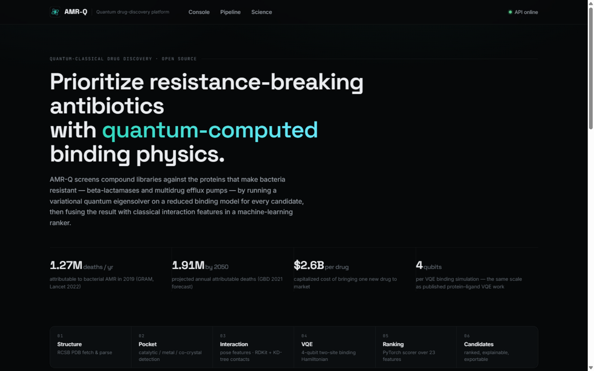

<div align="center">

# 🧬 AMR-Q

### Quantum-Assisted Antibiotic Resistance Fighter

**An open-source quantum-classical pipeline that screens compound libraries against
antimicrobial-resistance proteins — VQE binding physics + ML ranking — entirely on
free simulators and open data.**

[](https://www.python.org/)
[](https://qiskit.org/)
[](https://pytorch.org/)
[](https://fastapi.tiangolo.com/)
[](LICENSE)
[](#run-the-tests)

</div>

---



<p align="center"><i>The AMR-Q screening console — NDM-1 metallo-β-lactamase vs 38 compounds,
VQE verified against exact diagonalization in-run.</i></p>

Antimicrobial resistance already kills **[1.27 million people per year](docs/RESEARCH.md#1-the-antimicrobial-resistance-amr-burden)**
(Lancet/GRAM 2022) and is forecast to reach **1.91 million attributable deaths per year by
2050**. Bacteria evolve faster than we discover antibiotics, and early-stage discovery is
slow, expensive (~$2.6B per approved drug) and mostly blind to resistance mechanics.

**AMR-Q attacks the discovery bottleneck in software:** pick a resistance protein
(β-lactamase, carbapenemase, efflux pump…), and the platform places every library
compound into its binding pocket, builds a **4-qubit two-site binding Hamiltonian**,
solves for the ground state with a **Variational Quantum Eigensolver**, and fuses the
quantum result with classical interaction features in a **PyTorch ranking model** —
producing a ranked, explainable list of resistance-breaking candidates in minutes.

> **Honest positioning:** this is a research/education prototype. The quantum layer is a
> reduced two-site model at the same scale as published protein–ligand VQE work
> (4-qubit active spaces; see [docs/RESEARCH.md](docs/RESEARCH.md)) — it produces a
> *relative scoring signal*, not validated binding free energies. Methodology and
> limitations are documented in [docs/SCIENCE.md](docs/SCIENCE.md).

## 📄 Research paper

A full paper describing this system is included in the repository:
**[paper/amrq_paper.pdf](paper/amrq_paper.pdf)** — *"AMR-Q: A Quantum–Classical Hybrid
Pipeline for Prioritizing Resistance-Breaking Antibiotic Candidates"* (LaTeX source in
[`paper/amrq_paper.tex`](paper/amrq_paper.tex); figures regenerate from raw pipeline
outputs via `python scripts/paper_figures.py`).

## What you get

| | |
|---|---|
| 🎯 **Curated resistance panel** | TEM-1, KPC-2, CTX-M-14 (class A) · NDM-1 metallo-β-lactamase (Zn site, chelation-aware) · AmpC (class C) · AcrB efflux pump (distal pocket) — or any PDB entry |
| 💊 **168-compound library** | antibiotics across 25 classes + clinical β-lactamase inhibitors + NDM-1 chelators + efflux-pump adjuvants + 14 decoy controls (PubChem/ChEMBL-validated SMILES) |
| ⚛️ **Real VQE** | particle-conserving excitation ansatz, COBYLA/SPSA, exact-diagonalization benchmark inside every run; pluggable backends: statevector → EstimatorV2 → Aer → **IBM Quantum hardware** |
| 🧠 **Explainable ML ranking** | 23 features → score, with per-compound gradient attribution, VQE convergence plots and binding-model parameters in the dashboard |
| 🖥️ **Professional dashboard** | live progress, ranked table, quantum detail reports, CSV export |
| ✅ **48 tests** | quantum correctness (VQE = exact diag), parser geometry, API contract, library integrity |

## Quickstart

```bash
git clone <this-repo>
cd AMR-Q

python -m venv .venv
# Windows: .venv\Scripts\activate     |     macOS/Linux: source .venv/bin/activate

pip install -r requirements.txt
# smaller CPU-only torch (optional):
#   pip install torch --index-url https://download.pytorch.org/whl/cpu

uvicorn amrq.api.main:app
# → open http://127.0.0.1:8000
```

Pick a target, press **Run quantum screen**, and watch the VQE loop work through the
library (~1 s per compound). A pre-trained ranker and all data files ship with the repo,
so nothing else is required.

### Command line

```bash
# end-to-end demo (fetches TEM-1, screens 25 compounds, prints a ranked table)
python scripts/run_demo.py --target tem-1 --limit 25

# other targets: tem-1 | kpc-2 | ctx-m-14 | ndm-1 | ampc | acr-b
python scripts/run_demo.py --target ndm-1 --limit 40

# rebuild the data files yourself
python scripts/build_library.py            # fetch + validate SMILES (PubChem/ChEMBL)
python scripts/generate_training_data.py   # features + labels across all targets
python scripts/train_ranker.py             # train the PyTorch ranker
```

### REST API

```bash
curl http://127.0.0.1:8000/api/targets                       # resistance panel
curl -X POST http://127.0.0.1:8000/api/analyze \             # start a screen
     -H "Content-Type: application/json" \
     -d '{"target_key": "ndm-1", "limit": 30, "backend": "statevector"}'
curl http://127.0.0.1:8000/api/jobs/<job_id>                 # progress
curl http://127.0.0.1:8000/api/jobs/<job_id>/results         # full results
curl http://127.0.0.1:8000/api/jobs/<job_id>/results.csv     # export
curl -X POST http://127.0.0.1:8000/api/quantum/demo \        # single-molecule VQE report
     -H "Content-Type: application/json" \
     -d '{"smiles": "O=C(O)c1nc(C(=O)O)cccc1", "target_key": "ndm-1"}'
```

Custom proteins work too: POST raw PDB text as `pdb_text` (pocket auto-detected from
the co-crystal ligand), or specify `pocket_residues` manually.

## How the science works (short version)

```
protein ──▶ pocket ──▶ ligand poses ──▶ interaction features ──▶ 4-qubit VQE ──▶ ML rank
 (PDB)     catalytic/   RDKit 3D         contacts · H-bonds ·        ground state:
           metal /     + rigid          charges · chelation ·        ΔE stabilization +
           co-crystal  placement        clashes                      CT character
```

- **The quantum model** condenses the binding interface into a two-site donor–acceptor
  (extended-Hubbard-style) Hamiltonian: ligand HOMO/LUMO coupled to pocket HOMO/LUMO,
  with on-site energies and couplings mapped from the interaction features. VQE finds
  the ground state; the **stabilization energy ΔE = E_coupled − E_decoupled** and the
  ground state's **charge-transfer character** become scoring features. For metallo
  targets (NDM-1) the model explicitly rewards **metal chelation** — the actual mechanism
  of known NDM-1 inhibitors.
- **The ansatz** is particle-conserving by construction (Givens excitation gates), so
  the same circuit can run unchanged on IBM Quantum hardware.
- **Every VQE result is verified** against exact diagonalization of the same
  Hamiltonian — the dashboard reports the error per compound.

Full methodology: **[docs/SCIENCE.md](docs/SCIENCE.md)** · Research with sources:
**[docs/RESEARCH.md](docs/RESEARCH.md)** · System design: **[docs/ARCHITECTURE.md](docs/ARCHITECTURE.md)**

## Sample output (TEM-1 β-lactamase, 1BTL, 24 compounds)

```
pocket    : 9 residues (curated): SER70, LYS73, SER130, ASN132, GLU166, GLU171, LYS234, SER235, GLY236
vqe       : HF + 2 layer(s) of 4 single-excitation gates; mean |E_vqe - E_exact| = 0.00e+00
screened  : 24 compounds in 44s

 #  compound                        score   dE/eV  class                  known
-------------------------------------------------------------------------------
 1  Ceftaroline                     0.710  -0.262  cephalosporin          class_a;class_b;class_c;class_d
 2  Ceftazidime                     0.708  -0.261  cephalosporin          class_a;class_b;class_c;class_d
 3  Cefazolin                       0.706  -0.261  cephalosporin          class_a;class_c;class_d
 4  Cefuroxime                      0.612  -0.249  cephalosporin          class_a;class_b;class_c;class_d
 8  Sulbactam                       0.608  -0.248  beta-lactamase inhibit class_a
15  Ciprofloxacin                   0.308  -0.249  quinolone              efflux
```

The known-chemistry sanity check passes: β-lactams and β-lactamase inhibitors occupy the
top of a class-A β-lactamase screen; mechanistically unrelated compounds sink.

## Run the tests

```bash
pytest tests/ -q
# 48 passed (1 pipeline integration test activates after the demo populates the cache)
```

## Project layout

```
amrq/
  quantum/   fermion algebra · two-site binding model · VQE · backends
  protein/   RCSB fetch · BioPython parsing · pocket detection · target panel
  molecules/ library · RDKit processing · interaction features
  ml/        features · expert weak supervision · PyTorch ranker · training
  api/       FastAPI server + job runner
frontend/    React dashboard (no build step; served by the API)
data/        curated library · target panel · training set · trained model
scripts/     build_library · generate_training_data · train_ranker · run_demo
docs/        RESEARCH.md · SCIENCE.md · ARCHITECTURE.md
tests/       48 tests (quantum correctness, geometry, API, library integrity)
```

## Extending AMR-Q

- **New resistance target** — add one entry to `data/proteins/known_targets.json`
  (PDB ID + pocket residues). It appears in the dashboard automatically.
- **New compounds** — add rows to `data/compounds/library_source.json` and re-run
  `scripts/build_library.py`.
- **Real IBM hardware** — `pip install qiskit-ibm-runtime`, set `AMRQ_IBM_TOKEN`,
  select the backend in the UI.
- **Better docking** — the interaction layer is intentionally swappable
  (`amrq/molecules/interactions.py`); see the roadmap in [docs/SCIENCE.md](docs/SCIENCE.md).

## Disclaimer

AMR-Q is an open-source research and education prototype. It is **not** a validated
drug-discovery pipeline and provides **no medical, clinical or therapeutic guidance**.
The quantum-computed quantities are reduced-model scoring signals. See
[docs/SCIENCE.md §6](docs/SCIENCE.md#6-what-amr-q-does-not-claim).

## License

[MIT](LICENSE) — free for research, education and reuse.
